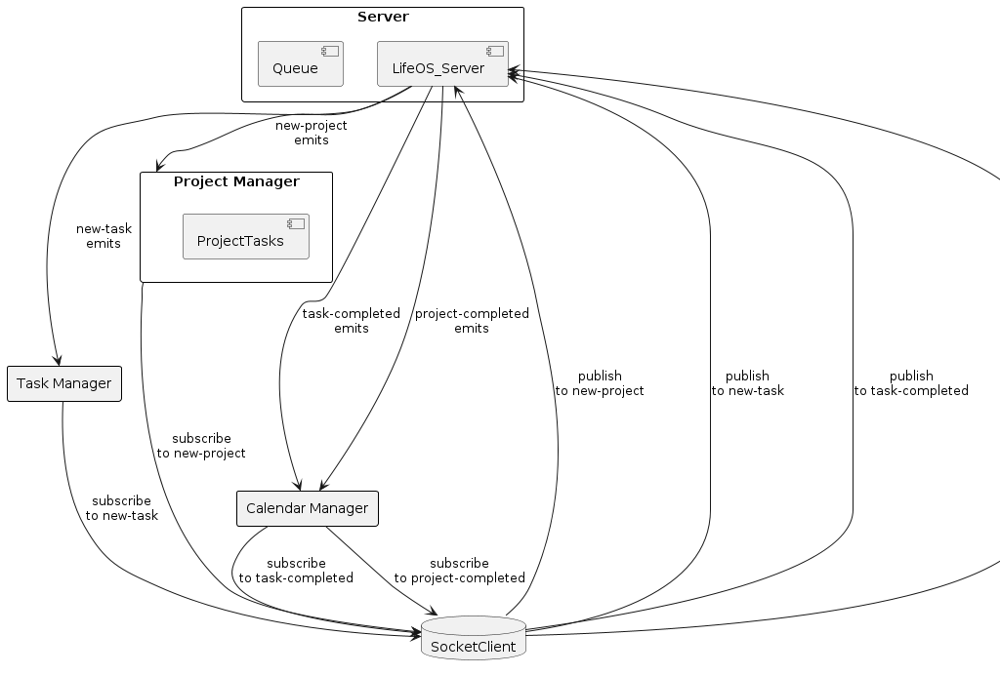

# LAB - Class 14

## Project: Life OS Backend

### Author: Bryan O. Garduno Gonzalez

### Problem Domain

Life OS Backend is a sophisticated project management system designed to streamline the task and project management process in real-time. It leverages a server-based architecture to manage projects, tasks, and their respective deadlines efficiently. The system ensures that all project and task events, from creation to completion, are reliably communicated and tracked, enhancing collaboration and productivity.

### Links and Resources

- [GitHub Actions ci/cd](https://github.com/brosmar18/life-os-backend/actions) 
- Dev [Back-end server Dev Branch url]()
- Main [back-end server main branch url]()

### Collaborators

- **ChatGPT by OpenAI**: Used as a programming partner for brainstorming ideas, debugging code, formulating tests, and drafting documentation. ChatGPT's contributions were invaluable in enhancing the efficiency and quality of the development process.

### Setup

#### `.env` requirements (where applicable)

A `.env` file is included in the local repository. A `.env-sample` file is uploaded to the remote repo so collaborators understand what environmental variables are being used. 

#### How to initialize/run your application (where applicable)

- `npm start` to start the server

## Features

- **Real-time Project Management**: Efficiently manages projects and tasks, with real-time updates and tracking.
- **Deadline Management**: Each task and project has its own deadline, ensuring time-bound completion.
- **Socket Communication**: Uses socket.io for real-time communication between different components of the system.
- **Event-Driven Architecture**: The system reacts to various events such as new tasks, task completion, and project completion, ensuring seamless workflow.
- **Dynamic Task Allocation**: New tasks can be added to ongoing projects dynamically.
- **Robust Testing**: Comprehensive tests cover the core functionalities, ensuring system reliability.

### Running the Tests:

To run the tests for the Life OS Backend project, use the command:

`npm test`

### Incomplete or Skipped Tests:

All tests have been completed and no tests were skipped, ensuring thorough coverage and system reliability.

#### UML

;
